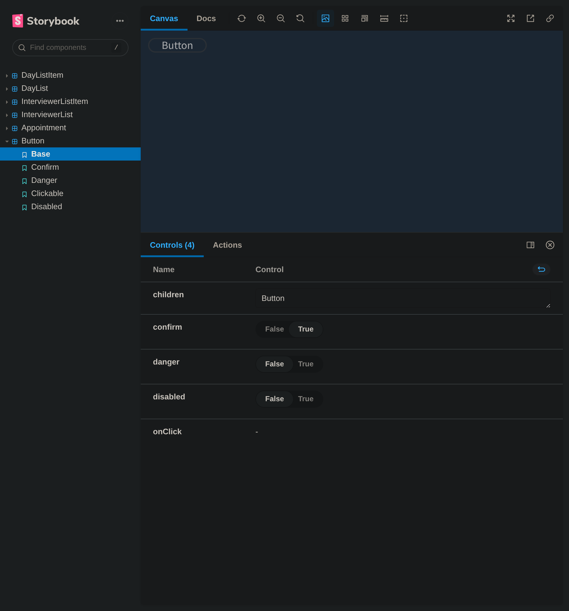

# Interview Scheduler

A React-based single-page application that allows users to book, edit, and cancel interviews.

This project was built as part of the Lighthouse Labs Web Development Bootcamp. It features a client-side application created with Create React App and a backend API server.

<!-- Placeholder for a screenshot of the main application UI -->


## Development Environments

The project is configured to run in three distinct environments:

1.  **Webpack Dev Server**: The primary environment for running the application locally.
2.  **Storybook**: A tool for developing and showcasing UI components in isolation.
3.  **Jest**: The testing framework used for running unit and integration tests.

## Setup

1.  Install dependencies: `npm install`
2.  The project requires a backend API server. Ensure it is running on `http://localhost:8001`.
3.  Run the client-side application: `npm start`

## Running Tests

All 32 tests across 7 test suites are currently passing.

To run the test suite:
```bash
npm test
```

### Debugging Tests in VS Code

A VS Code launch configuration has been set up to allow for easy debugging of the Jest tests.

**To use the debugger:**

1.  Open the "Run and Debug" panel in VS Code.
2.  Select the **"Debug CRA Tests"** configuration from the dropdown menu.
3.  Set breakpoints in your code.
4.  Click the green "play" button to start the debugger.

**Workspace Configuration:**

*   **Standalone Project**: If you open the `scheduler` directory as the root folder in VS Code, the launch configuration in `.vscode/launch.json` will work automatically.
*   **Multi-root Workspace**: If you are working in a larger workspace (like the parent `lighthouse` directory), you must add the `scheduler` directory as a distinct folder in your `.code-workspace` file. This allows VS Code to discover and use its specific `launch.json` configuration.

## Storybook

Storybook is used to visualize and interact with UI components in isolation.

Run Storybook:
```bash
npm run storybook
```


### Storybook Configuration

The Storybook configuration has been updated to support the modern **Component Story Format (CSF)** and the practice of **co-locating** stories with their component files.

The configuration in `.storybook/main.js` was modified to load stories from two locations:
1.  The original, monolithic `stories/index.js` file.
2.  Any file within `src/` that ends with the `.stories.js` extension.

#### Storybook Features: Controls & Actions

The `Button` component's stories have been migrated to the new CSF format in `src/components/Button.stories.js`. This enables two powerful Storybook features:

*   **Controls**: An interactive panel that allows you to dynamically edit the component's props in real-time. This is invaluable for testing different component states and for collaborating with designers.
*   **Actions**: A panel that logs the output of event handler props, such as `onClick`. This helps verify that component interactions are firing correctly.

**Stretch Goal**: A great next step would be to migrate the stories for other components from `stories/index.js` to the new co-located CSF format. This would enable the Controls and Actions features for those components as well, further improving the development and collaboration workflow.
